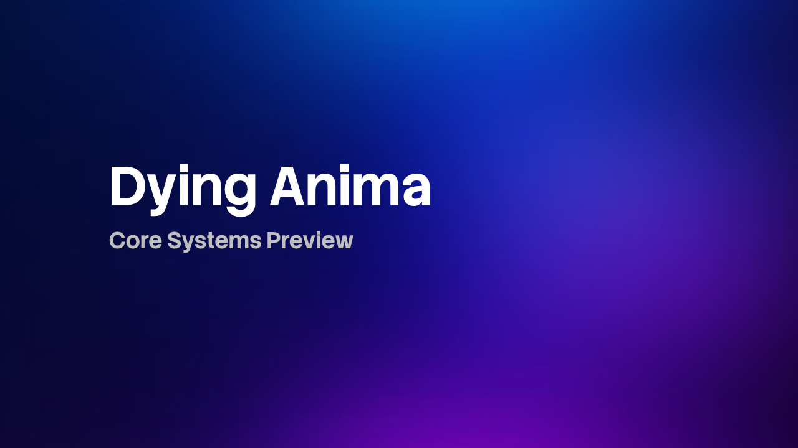
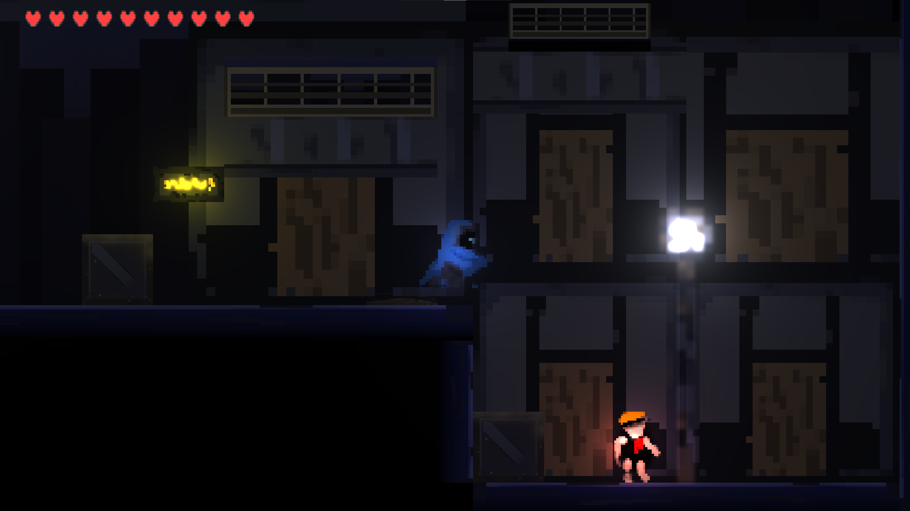
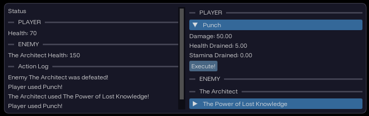
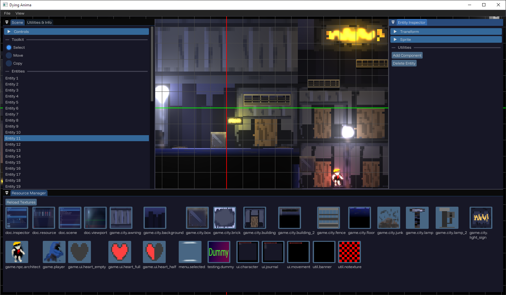
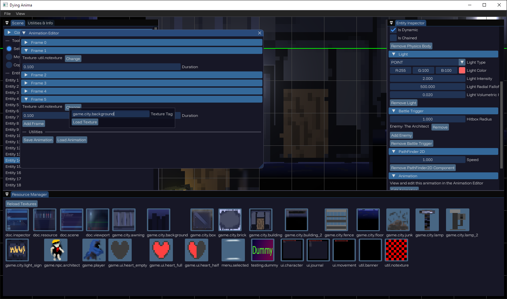

# Dying Anima

**A story about Death and Immortality**

---

# Screenshots
## In Game

## In Editor

# Story
Check out [the story](docs/story.md)
TL;DR:
- You play as a character who has been reincarnated by *the binding* which grants immortality to everyone in the ultradeveloped city of *Mer*.
- Every reincarnation fragments more and more of your memories, making spells harder to cast and making you vulnerable to the dangers of the world.
- You go on a journey to break this binding and free everyone from immortality.

# More Info
## Used Dependencies
- Box2D
- Freetype
- glad
- glfw3
- glm
- imgui
- OpenGL
- pugixml
- EnTT
- tinyfiledialogs
# Installation
## Linux
### Build from source
1. Clone this repo: `git clone https://github.com/sohiearth/dying-anima --recursive`
2. cd into the newly cloned repo: `cd dying-anima`
3. Use the `linux` configure preset to configure cmake. `cmake --preset=linux`
4. If no vcpkg errors occurred, build the app using `cmake --build --preset=debug-linux` (Debug) or `cmake --build --preset=release-linux` (Release)
5. Run the app `./build/linux/debug/dying-anima` (Debug) || `./build/linux/release/dying-anima` (Release)
### Download
1. Download the latest Linux release.
2. Install dependencies from your package manager.
`pugixml`
Example on arch: `sudo pacman -Sy pugixml`
3. Run (make sure working directory contains the assets folder.)
## Windows
### Build from source
1. Clone the repo using Visual Studio.
2. Configure and build. Should be pretty simple.
### Download
1. Download the latest Windows release.
2. Run (make sure working directory contains the assets folder.)
## Mac
### Build from source
1. Clone this repo: `git clone https://github.com/sohiearth/dying-anima --recursive`
1. cd into the newly cloned repo: `cd dying-anima`
1. Use the `macos` configure preset to configure cmake. `cmake --preset=macos`
1. If no vcpkg errors occurred, build the app using `cmake --build --preset=debug-macos` (Debug) or `cmake --build --preset=release-macos` (Release)
1. Run the app `./build/macos/debug/dying-anima` (Debug) || `./build/macos/release/dying-anima` (Release)
### Download
*Good news! No need to install dependencies on Mac!*
1. Download the latest Mac release.
2. Run the app. (make sure working directory contains the assets folder.)